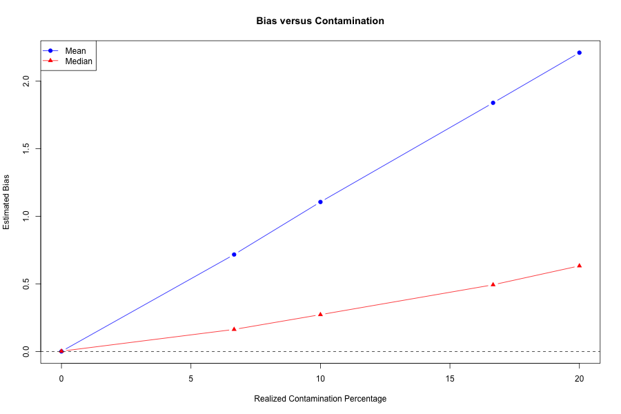
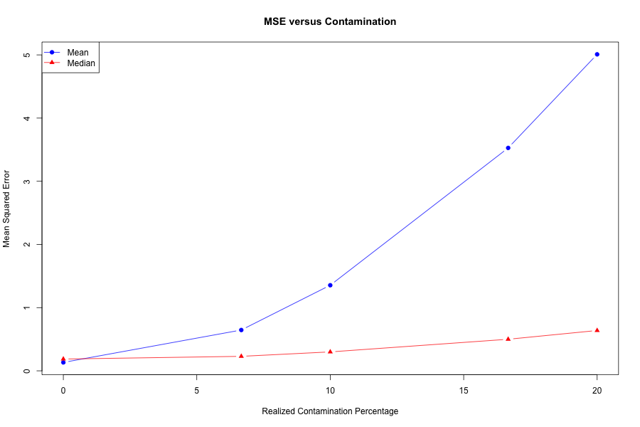
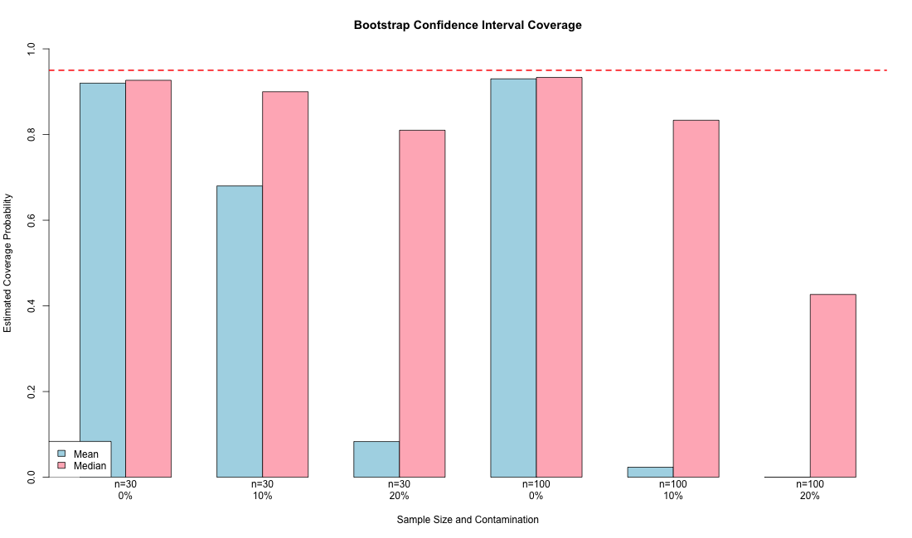
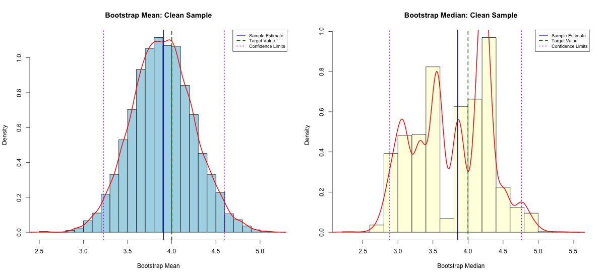
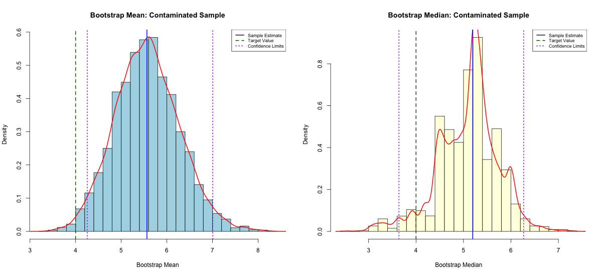
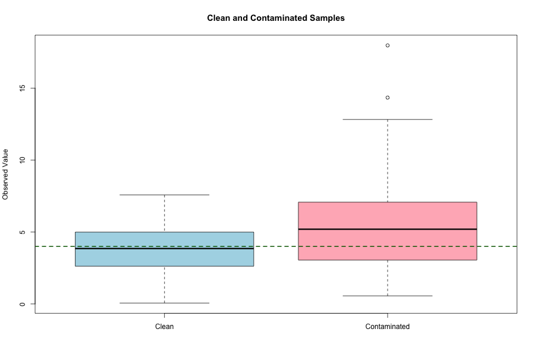
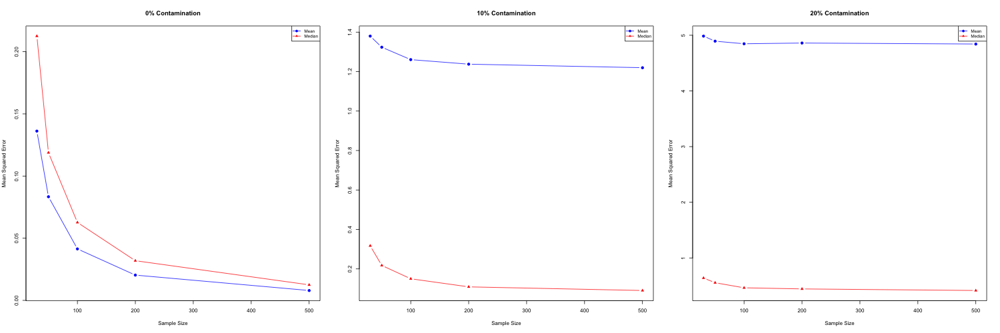
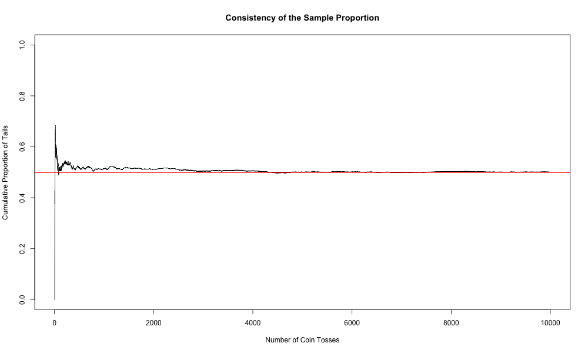
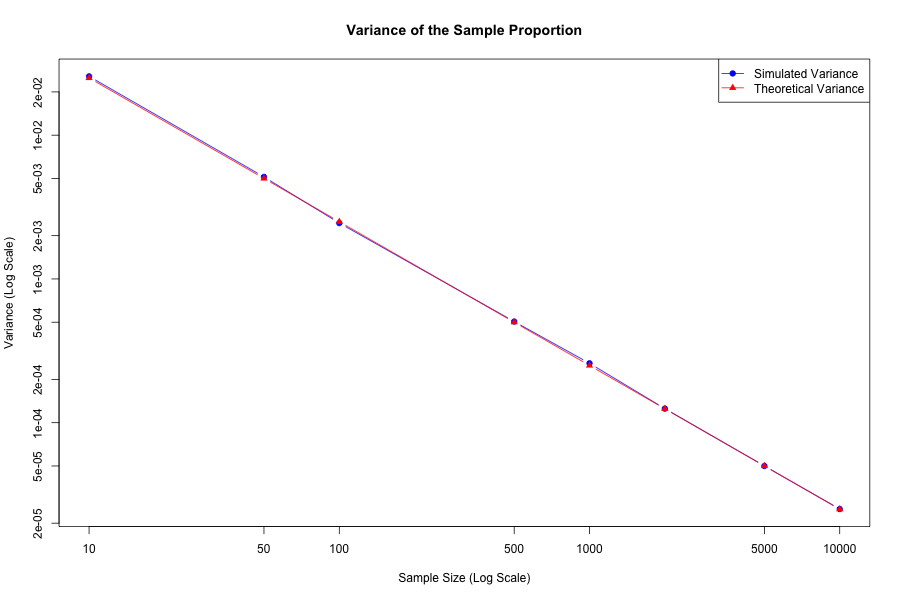

# A Bootstrap Simulation Study of the Efficiency and Robustness of the Mean and Median

## Project Overview

This project uses bootstrap resampling and Monte Carlo simulation to compare the sample mean and sample median under clean and contaminated normal data.

The analysis focuses on:

- estimator efficiency
- robustness to outliers
- bias
- variance
- mean squared error
- percentile bootstrap confidence intervals
- confidence-interval coverage
- consistency of a sample proportion

The project was originally developed from STAT 653 coursework and later expanded into a reproducible statistical computing project using Base R.

---

## Research Questions

1. Which estimator is more efficient under clean normal data?
2. How does contamination affect the mean and median?
3. How do bias, variance, and MSE change as contamination increases?
4. Does increasing the sample size reduce estimator error?
5. How well do 95% percentile bootstrap confidence intervals cover the target value?
6. Does the sample proportion converge to the true probability as sample size increases?

---

## Data-Generating Process

### Clean data

Clean observations are generated from a normal distribution with:

- mean = 4
- standard deviation = 2

In R:

```r
rnorm(n, mean = 4, sd = 2)
```

### Contaminated data

Outliers are generated from a second normal distribution with:

- mean = 15
- standard deviation = 2

In R:

```r
rnorm(n_outliers, mean = 15, sd = 2)
```

The contamination levels examined are:

- 0%
- 5%
- 10%
- 15%
- 20%

The sample sizes examined are:

- 30
- 50
- 100
- 200
- 500

Because the number of outliers must be an integer, the realized contamination percentage may differ slightly from the requested percentage for some sample sizes.

---

## Methods

### Bootstrap analysis

For each sample, the script calculates bootstrap distributions for the mean and median.

The detailed bootstrap analysis uses:

```r
B_detailed <- 5000
```

The bootstrap analysis reports:

- original sample estimate
- bootstrap average
- bootstrap-estimated bias
- bootstrap variance
- bootstrap standard error
- 95% percentile bootstrap confidence interval
- confidence-interval width
- squared error relative to the target value 4

### Relative efficiency

Relative efficiency is calculated as:

```text
Relative Efficiency = Variance(Median) / Variance(Mean)
```

Interpretation:

- Relative Efficiency greater than 1: the mean has lower variance
- Relative Efficiency less than 1: the median has lower variance
- Relative Efficiency equal to 1: both estimators have equal variance

### Monte Carlo simulation

The full data-generation process is repeated 1,000 times for each sample-size and contamination combination.

For each estimator, the simulation calculates:

- average estimate
- bias
- variance
- mean squared error
- relative efficiency
- estimator with lower variance
- estimator with lower MSE

Mean squared error is interpreted as:

```text
MSE = Variance + Bias^2
```

### Bootstrap confidence-interval coverage

The project estimates how often the 95% percentile bootstrap confidence intervals contain the uncontaminated target value 4.

Coverage is examined for:

- sample sizes 30 and 100
- contamination levels 0%, 10%, and 20%
- both the mean and median

### Consistency of the sample proportion

The project also simulates repeated fair-coin tosses with probability 0.5.

The sample proportion is:

```text
p_hat = number of tails / number of tosses
```

The theoretical variance is:

```text
Variance(p_hat) = p(1 - p) / n
```

For p = 0.5:

```text
Variance(p_hat) = 0.25 / n
```

---

## Main Findings

### Clean normal data

Under clean normal data, the sample mean generally had:

- lower variance
- lower MSE
- greater efficiency

In the detailed clean-sample bootstrap analysis, the relative efficiency was approximately 2.27.

### Effect of contamination

As contamination increased, the sample mean became much more biased than the sample median.

For sample size 30:

| Realized Contamination | Mean MSE | Median MSE | Better by MSE |
|---:|---:|---:|:---|
| 0% | 0.1330 | 0.1865 | Mean |
| 6.7% | 0.6459 | 0.2293 | Median |
| 10% | 1.3545 | 0.2994 | Median |
| 16.7% | 3.5273 | 0.4995 | Median |
| 20% | 5.0086 | 0.6382 | Median |

The mean often retained lower variance, but its larger bias caused its MSE to become much greater under contamination.

This demonstrates that lower variance does not necessarily mean better overall performance when an estimator is biased.

### Effect of sample size

Increasing the sample size reduced estimator variance.

However, increasing the sample size did not remove the bias caused by contamination. Under contaminated data, the median remained closer to the uncontaminated target value of 4.

### Confidence-interval coverage

For clean data, estimated coverage was approximately 92% to 93%.

Under contamination, coverage of the target value 4 declined sharply, especially for the mean.

For sample size 100:

| Contamination | Mean Coverage | Median Coverage |
|---:|---:|---:|
| 0% | 0.930 | 0.933 |
| 10% | 0.023 | 0.833 |
| 20% | 0.000 | 0.427 |

### Consistency of the sample proportion

The cumulative sample proportion approached 0.5 as the number of tosses increased.

At 10,000 tosses, the simulated cumulative proportion was approximately 0.5008.

The repeated simulation also showed that:

- average sample proportions remained close to 0.5
- simulated variance closely matched the theoretical variance
- MSE decreased as sample size increased
- the probability of a large estimation error approached zero

---

## Selected Figures

### Bias versus contamination



### MSE versus contamination



### Bootstrap confidence-interval coverage



### Bootstrap distributions for clean data



### Bootstrap distributions for contaminated data



### Clean and contaminated samples



### MSE versus sample size



### Cumulative sample proportion



### Simulated and theoretical variance



---

## Repository Structure

```text
bootstrap-mean-median-simulation/
|
|-- README.md
|-- bootstrap_mean_median_simulation.R
|
|-- figures/
|   |-- average_proportion_vs_sample_size.png
|   |-- bias_vs_contamination.png
|   |-- bootstrap_coverage.png
|   |-- clean_sample_bootstrap_distributions.png
|   |-- clean_vs_contaminated_boxplot.png
|   |-- contaminated_sample_bootstrap_distributions.png
|   |-- cumulative_sample_proportion.png
|   |-- mse_vs_contamination.png
|   |-- mse_vs_sample_size.png
|   |-- probability_outside_tolerance.png
|   |-- proportion_variance_vs_sample_size.png
|   |-- relative_efficiency_vs_contamination.png
|   `-- sample_proportion_boxplots.png
|
`-- results/
    |-- bootstrap_coverage_results.csv
    |-- clean_contaminated_bootstrap_results.csv
    |-- contamination_sensitivity_n30.csv
    |-- cumulative_proportion_selected_values.csv
    |-- full_simulation_results.csv
    |-- proportion_consistency_results.csv
    |-- relative_efficiency_comparison.csv
    |-- sample_information.csv
    `-- session_info.txt
```

---

## How to Run the Project

1. Download or clone the repository.
2. Open the repository folder in R or RStudio.
3. Run:

```r
source("bootstrap_mean_median_simulation.R")
```

The script automatically creates the following folders if they do not already exist:

```text
figures/
results/
```

The confidence-interval coverage section is the most computationally intensive part of the analysis.

---

## Software Requirements

The project uses only Base R and does not require additional packages.

The analysis was run using:

```text
R version 4.4.1
Platform: Apple Silicon macOS
```

Base R components used include:

- stats
- graphics
- grDevices
- utils

---

## Reproducibility

Fixed random seeds are used throughout the script.

Examples:

```r
set.seed(123)
set.seed(456)
set.seed(789)
set.seed(2026)
```

The script also saves the R session information to:

```text
results/session_info.txt
```

---

## Limitations

- The project uses simulated data rather than real-world data.
- Only one outlier distribution is examined.
- Only the sample mean and sample median are compared.
- Only percentile bootstrap confidence intervals are used.
- Coverage is evaluated relative to the uncontaminated target value 4.
- Simulation results contain Monte Carlo error.
- Results may differ for skewed, heavy-tailed, or multimodal distributions.

---

## Possible Future Extensions

- trimmed means
- Huber estimators
- skewed distributions
- heavy-tailed distributions
- BCa bootstrap confidence intervals
- basic and normal bootstrap intervals
- parallel computing
- real-world contaminated datasets

---

## Conclusion

Under clean normal data, the sample mean was generally more efficient and had lower MSE.

Under contaminated data, the mean became strongly biased. Although it often retained lower variance, its MSE became much larger than the median's MSE.

The sample median was less efficient under ideal normal conditions but substantially more robust in the presence of outliers.

The consistency simulations also showed that the sample proportion approached its true probability and that its variance decreased as sample size increased.

---

## Author

**Foysal Ahmed**

Statistical computing and simulation project developed from STAT 653 coursework.
